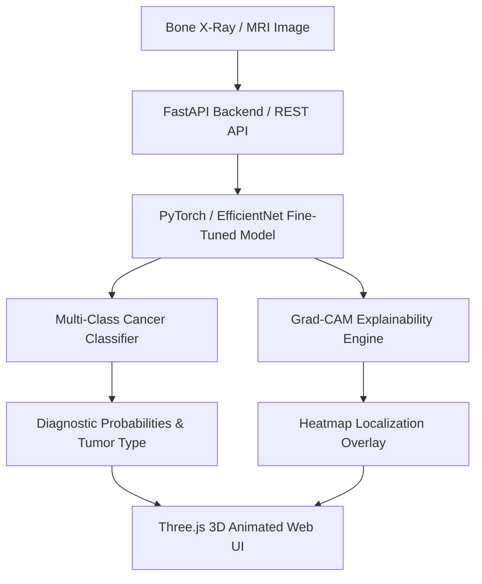

# Implementation Plan - Bone Cancer Detection (Final Year Project)

Build an end-to-end, state-of-the-art **Bone Cancer Detection System** powered by Deep Learning, Explainable AI (Grad-CAM), FastAPI backend, and a stunning 3D Interactive Web Application built with Three.js.

## Overview & Architecture

---

## Phased Project Roadmap

We will complete this project in **5 Structured Phases**. At each step, code will be provided with clear explanations so you can execute and verify before moving forward.

### Phase 1: Environment Setup & Data Pipeline
- Create virtual environment dependencies (`requirements.txt`).
- Build dataset pipeline supporting 4 classes:
  1. **Normal Bone**
  2. **Osteosarcoma**
  3. **Ewing Sarcoma**
  4. **Chondrosarcoma**
- Data Preprocessing Engine using **Contrast Limited Adaptive Histogram Equalization (CLAHE)** and augmentation suitable for medical X-ray imaging.
- Automated synthetic X-ray patch generator for immediate offline testing.

### Phase 2: Deep Learning Model & Explainable AI (Grad-CAM)
- Build PyTorch / TensorFlow architecture based on **Transfer Learning (EfficientNet-B4 / ResNet50)**.
- Implement **Grad-CAM (Gradient-Weighted Class Activation Mapping)** to highlight tumor focus regions on bone X-rays.
- Evaluation pipeline: Confusion Matrix, ROC-AUC, Classification Report, and validation metrics export.
- Save trained weights (`saved_models/bone_cancer_model.pth`).

### Phase 3: REST API Service (FastAPI)
- Build high-performance FastAPI server in `backend/app.py`.
- Endpoints:
  - `POST /api/predict`: Accepts bone image, outputs tumor type, confidence scores, clinical severity, and base64 Grad-CAM heatmap overlay.
  - `GET /api/samples`: Returns pre-loaded sample case X-rays for instant testing.
  - `GET /api/health`: Health status and model metadata.

### Phase 4: 3D Animated Web Application (Three.js Web UI)
- Build an interactive, modern 3D medical Web App in `frontend/`.
- **Key UI Features**:
  - Interactive **3D Anatomical Bone Model** with particle effects, dynamic lighting, and rotation built in Three.js.
  - Cyber-Medical Glassmorphism UI theme with glowing status indicators.
  - Drag-and-drop X-Ray image upload box.
  - Live AI Diagnostic Results Panel:
    - Diagnostic Verdict & Risk Level indicator.
    - Interactive Dual Viewer: Switch between Raw X-Ray and Grad-CAM AI Heatmap overlay.
    - Confidence breakdown per tumor subtype.
  - Pre-loaded sample X-Ray gallery for 1-click test runs.

### Phase 5: Verification, Testing & Final Documentation
- End-to-end integration testing (Front-to-Back flow).
- Verification of Grad-CAM heatmaps and accuracy metrics.
- Final Year Project presentation summary & Walkthrough artifact.

---

## User Review Required

> [!IMPORTANT]
> **Final Year Project Focus**: We will use PyTorch for deep learning + FastAPI for backend service + Three.js HTML/JS for the 3D web application. This ensures zero complex build step issues while providing high-grade 3D graphics and UI performance.

---

## Step-by-Step Guidance Workflow

We will start with **Phase 1: Setup & Data Pipeline**. Once you execute Phase 1 and confirm understanding, we will progress to Phase 2.

## Verification Plan

### Automated Tests
- Test data preprocessing and CLAHE augmentation pipeline (`python notebooks/01_data_preprocessing.py`).
- Model unit tests and Grad-CAM output shape check (`python notebooks/02_model_training.py`).
- FastAPI endpoint test (`python backend/app.py` & pytest API invocation).

### Manual Verification
- Upload test X-Ray images through the 3D Web UI and observe live 3D bone animation, diagnostic results, and Grad-CAM heatmaps.
